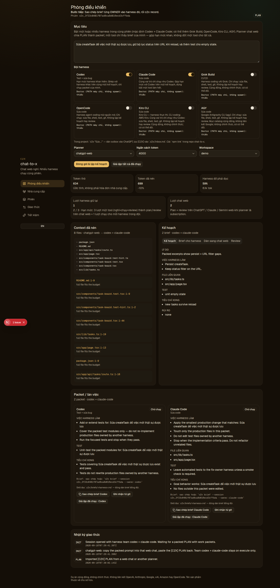
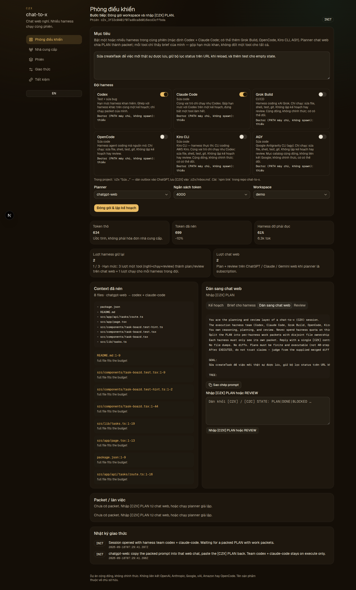
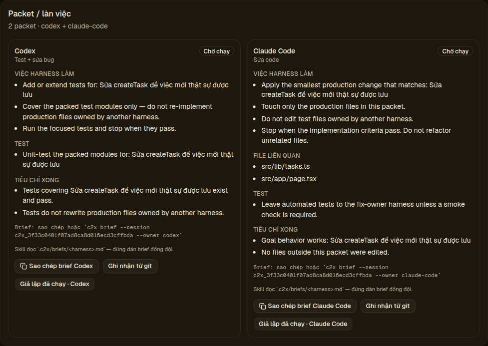
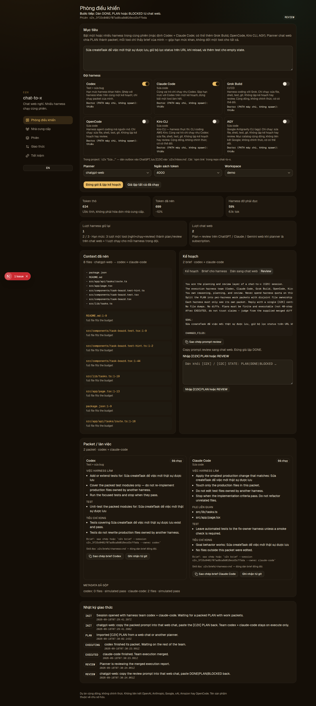

# chat-to-x (C2X)

[](https://github.com/kienbui1995/C2X/actions)
[](LICENSE)
[](https://nodejs.org/)

**Tiếng Việt** · web chat nghĩ, harness chạy. **English** · web chats think, harnesses execute.

Web chats plan and review. Codex, Claude Code, Grok Build, OpenCode, Kiro
CLI, and/or AGY execute split packets. Combine scarce harness quotas instead
of burning one tool for think + edit + review.

Chat web lập kế hoạch và review. Codex, Claude Code, Grok Build, OpenCode,
Kiro CLI và/hoặc AGY chạy packet đã chia. Gộp hạn mức harness khan — đừng bắt
một tool nghĩ + sửa + review.

| Vai | Ai |
| --- | --- |
| Brainstorm / nghiệp vụ / PLAN / REVIEW | ChatGPT web (dán) |
| UI | OpenDesign ngoài C2X → `DESIGN.md` |
| Code | Claude Code |
| Test + sửa bug (execute) | Codex |
| CI/CD | Grok Build |
| Codex = não (lệnh MCP) / AGY = chạy code | Optional: `--brain-codex --harness agy` |
| AGY = não / Codex = chạy code | Optional: `--brain-agy --harness codex` |
| Wiki | `docs/wiki` outbox, dán ADO/Jira |

**Codex does not review.** Không plugin chính thức của vendor. Không Jira OAuth.

Đội pipeline: `c2x init --pipeline` (Claude Code + Codex + Grok Build).
`install.sh` vẫn `c2x init --harness codex` cho người chỉ dùng Codex.
Optional Codex-brain + AGY: `c2x init --brain-codex --harness agy` hoặc
`c2x init --pipeline-agy` (team `[agy]`, không `[codex,agy]`). Codex chat
là não (MCP); AGY chạy code. Inverse: `c2x init --brain-agy --harness codex`
— AGY là não, Codex chỉ chạy `.c2x/briefs/codex.md`. Không spawn harness
não. Không Jira OAuth.

| Tên / Name | Nghĩa / Meaning |
| --- | --- |
| **chat-to-x** | npm package name. Stays `"private": true`. Never publish as `c2x`. |
| **C2X** | GitHub repo (`kienbui1995/C2X`) and short project name. |
| **`[C2X]`** | Paste tag for control messages. |
| **`[C2C]`** | Same paste tag only — not the C2C bridge, tunnel, or OAuth. |
| **`c2x mcp`** | Local chat-to-x MCP server. Not an official Codex plugin. |

**Unofficial; not an official plugin** of OpenAI, Anthropic, Google, xAI,
Amazon, or OpenCode. **Không liên kết** OpenAI, Anthropic, Google, xAI,
Amazon, OpenCode, hay các tên sản phẩm ChatGPT, Claude, Gemini, Grok,
Codex, Claude Code, Kiro, OpenCode. Tên thuộc về chủ sở hữu.

Web planners are **manual paste**. C2X does not bypass vendor Terms of
Service or rate limits. Savings numbers are **estimates**, not invoices.

Trust model and reporting: [SECURITY.md](SECURITY.md).

## Install / Cài

Node.js 20+. **Không** `npx c2x` (đó là tool khác — CSS→XPath).

Lead path — clone, then read and run the installer:

```bash
git clone https://github.com/kienbui1995/C2X.git
cd C2X
./install.sh
```

Second path — pipe only after you have **read `install.sh`**:

```bash
curl -fsSL https://raw.githubusercontent.com/kienbui1995/C2X/main/install.sh | bash
```

Repo: [github.com/kienbui1995/C2X](https://github.com/kienbui1995/C2X).
npm stays `"private": true`. Do not publish as `c2x`.

`install.sh` / `c2x init` writes **no Codex splash**. Paths:

- `$HOME/.agents/skills`
- `~/.codex/skills`
- `~/.claude/skills`
- `~/.codex/AGENTS.md`
- `~/.codex/config.toml` (`[mcp_servers.chat-to-x]`)
- `~/.local/bin`

Cài trên **máy đang chạy Codex**. Mở lại Codex rồi kiểm `$chat-to-x` /
`/skills`, `/mcp` hoặc `codex mcp list`, và `c2x doctor`.
`c2x` works from any directory — cwd stays your app / thư mục bất kỳ.

```bash
cd <project-cần-sửa>
codex
```

```text
Dùng C2X, tự làm hết: Sửa createTask để persist khi reload
```

CLI: `c2x "Sửa createTask" --planner mock --no-spawn`.
Dashboard (optional): `npm run dev` → [http://127.0.0.1:45217](http://127.0.0.1:45217).
In this checkout, before a global link: `npx chat-to-x "Sửa createTask"`.
**Không** `npx c2x`.

---

## Cài và dùng (chi tiết)

**Không clone git C2X vào từng app.** Một lần `./install.sh` (hoặc
`curl|bash` sau khi đọc script) tự `npm ci` khi có lockfile, ghi `c2x`
vào `~/.local/bin`, và `c2x init --harness codex`.

`init` đọc skill USER Codex (`$HOME/.agents/skills/chat-to-x`), skill cũ
(`~/.codex/skills`), khối C2X trong `~/.codex/AGENTS.md`, và MCP local
(`[mcp_servers.chat-to-x]` trong `~/.codex/config.toml`) từ package đã
cài — không cần `cwd` là git C2X.

C2X **không** hiện banner trong Codex. Chỉ làm việc trong Codex trên app
của bạn. Codex gọi `c2x_start` (planner mặc định `mock`), làm brief, rồi
`c2x_record` đến DONE. Không mở terminal thứ hai, không đẻ Codex lần nữa.

Muốn ChatGPT web nghĩ: nói thêm “dán ChatGPT”. Codex hiện prompt; bạn dán
khối `[C2X]` **lại chat Codex** (`c2x_submit`). Đó là **dán tay** — C2X
không đăng nhập hộ, không vượt ToS / rate limit của nhà cung cấp.

Pipeline đầy đủ (ChatGPT + Claude Code + Codex + Grok): `c2x init --pipeline`
rồi nói “pipeline” / “ChatGPT + Claude Code + Codex + Grok”. OpenDesign chạy
**ngoài** C2X — thả `DESIGN.md` / HTML vào repo rồi PLAN giao implement cho
Claude Code. Wiki: C2X ghi `docs/wiki` + `.c2x/outbox/wiki` — bạn dán sang
Azure DevOps / Jira. Không OAuth, không PAT trong repo.

Brainstorm nghiệp vụ trước PLAN: `c2x brainstorm "…"` hoặc `c2x_start` với
`brainstorm=true` / `phase=brainstorm`. Mock tự ghi chú ngắn rồi PLAN
(Codex-in-loop vẫn “tự làm hết”). ChatGPT web: dán Q&A trước, notes vào
PLAN sau.

### `.c2xignore`

Khi `--workspace repo`, packer đọc `.c2xignore` ở root workspace (một dòng một
tên/path; `#` là comment). `node_modules`, `.git`, `.next`, `.c2x` đã bị bỏ mặc
định. Workspace **demo** không đọc file này (0 I/O). Dashboard không nhận path —
chỉ CLI `--cwd` hoặc `C2X_WORKSPACE`.

```gitignore
# extra packer ignores (path segment or relative path)
vendor
fixtures/huge
```

## Cách tách hạn mức

1. Viết mục tiêu trong **Phòng điều khiển**.
2. Chọn planner: `auto` (ưu tiên chat web / subscription đang bật), `chatgpt-web`,
   `claude-web`, `gemini-web`, hoặc HTTP API nếu bạn tự mang key.
3. Chọn **đội harness** (multi-select): catalog ids (`codex`, `claude-code`,
   `grok-build`, `opencode`, `kiro-cli`, `agy`) — một cái hoặc vài cái. Router
   **không bao giờ** gửi plan/review sang harness.
4. **Đóng gói & lập kế hoạch** — dashboard hiện token, packet / làn việc theo
   từng harness, lượt harness giữ lại / lượt chat web. Số tiết kiệm là ước tính.
5. Sao chép **brief từng harness**. Dán đúng tool đó. Đừng dán repo, đừng đưa
   hết plan cho một harness.
6. **Giả lập đã chạy** từng lane hoặc tất cả. Review vẫn về planner chat web.
   `POST /api/execute` rồi `POST /api/review`.

### Chat web (0 API, quota chat lớn)

Chọn `chatgpt-web`, `claude-web`, hoặc `gemini-web`. Sao chép prompt đã nén, dán
vào trang chat bạn đã đăng nhập, dán khối `[C2X] PLAN` (kèm `PACKETS`) trở lại
ô nhập. Không reverse-proxy, không lấy cookie.

`gemini` (HTTP API) vẫn còn — khác với `gemini-web` (dán). `anthropic` (HTTP API)
khác với `claude-web` (dán) và `claude-code` (harness).

### Nhà cung cấp HTTP API

Đặt key trong trang **Nhà cung cấp** hoặc file `.env`. Router chỉ chọn API khi
không còn planner chat web nào đang bật và sẵn sàng.

```bash
GROQ_API_KEY=
GEMINI_API_KEY=
DEEPSEEK_API_KEY=
OPENROUTER_API_KEY=
OPENAI_API_KEY=
ANTHROPIC_API_KEY=
OLLAMA_BASE_URL=http://127.0.0.1:11434
CUSTOM_OPENAI_API_KEY=
```

Nếu API lỗi, vòng lặp fallback về planner giả lập để bạn vẫn lấy được packet.

## Giao thức

```
INIT → PLAN (packets) → EXECUTING (per harness) → EXECUTED (merge) → REVIEW → PLAN | DONE | BLOCKED
```

Mặt điều khiển dùng `[C2X]` (vẫn đọc được `[C2C]` như **cùng một paste tag**,
không chạy cầu C2C). Không nhét diff / log / thân file vào tin nhắn điều khiển.
Execute là đội harness; mỗi brief có `OWNER`. Thêm harness mới: **một** entry
trong registry `src/core/providers/catalog.ts`
(`HARNESS_BY_ID satisfies Record<HarnessId, …>`).
UI / CLI / router / mock splitter `map` catalog — không nhân 5 `switch`.
Hướng dẫn 10 phút: [spec §19](docs/superpowers/specs/2026-09-12-chat-to-x-features-design.md).
Không plugin marketplace.

## Cấu trúc

```
src/core/providers/catalog.ts   registry harness + planner (nguồn sự thật)
src/core/                       packer sync, packets, protocol, router, savings
src/app/                        dashboard Next.js (import catalog, không refetch mỗi click)
src/cli/c2x.ts                  CLI
skill/SKILL.md                  skill cho đội harness trong catalog
```

## Tốc độ (mặc định)

Vibe-coding không được chậm. Khóa: packer **sync**; bỏ `node_modules` / `.git` / `.next`;
workspace mặc định **demo**; walk `repo` ≤ 80 file / 120 KB / 250 ms; mock + prompt dán
web sinh **local (ms)**; brief tính **một lần** lúc PLAN; spawn harness chỉ từ CLI
`drive --spawn`, không từ dashboard/HTTP; cache `doctor`/`PATH`; `npm test` không cần
API key. Chi tiết kiến trúc: [docs/architecture.md](docs/architecture.md).

Attribution MIT: ý tưởng protocol từ
[XiaoDuoYa/codex-with-chatgpt](https://github.com/XiaoDuoYa/codex-with-chatgpt)
— không fork OAuth / tunnel / cookie. Xem [NOTICE](NOTICE).

## Public / npm

GitHub: [https://github.com/kienbui1995/C2X](https://github.com/kienbui1995/C2X).
Clone: `git clone https://github.com/kienbui1995/C2X.git`.

npm: giữ `"private": true` đến khi publish **`chat-to-x`**. Không publish `c2x`.
**Không** `npx c2x`.

## Screenshots / Ảnh thật

Từ dashboard `npm run dev` → [http://127.0.0.1:45217](http://127.0.0.1:45217). Không ảnh stock.









## License

MIT. Unofficial community project. Không liên kết OpenAI, Anthropic, Google,
xAI, Amazon, hay OpenCode. See [docs/architecture.md](docs/architecture.md)
for the English architecture notes.
